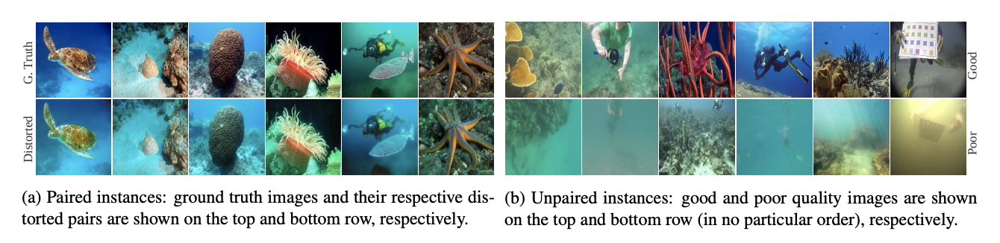

# FUnIE-GAN-PyTorch

PyTorch implementations of the [paper](https://arxiv.org/pdf/1903.09766.pdf).

## Dataset

The EUVP dataset can be downloaded from [here](http://irvlab.cs.umn.edu/resources/euvp-dataset). It contains several sets of paired data and unpaired data of good and poor quality. 



The folder structure is shown follows:

```
Paired/
├── underwater_imagenet/
│   ├── trainA/
│   ├── trainB/
│   └── validation/
├── underwater_dark/
│   ├── trainA/
│   ├── trainB/
│   └── validation/
└── underwater_scenes/
    ├── trainA/
    ├── trainB/
    └── validation/
Unpaired/
├── trainA/
├── trainB/
└── validation/
test_samples/
├── GTr/
└── Inp/
```

### Paired Data

Three sets(`underwater_imagenet`, `underwater_dark`, and `underwater_scenes`) of paired data are included. The statistics show as below:

|                     | Training Pairs | Validation |
|---------------------|----------------|------------|
| Underwater Imagenet | 3700           | 1270       |
| Underwater Dark     | 5550           | 570        |
| Underwater Scenes   | 2185           | 130	    |

However, the validation data are not in pairs. In our work, 90% of total pairs are used as training data and 10% of total pairs are used as validation data. Data splitting is executed using `data_split.py`.

```shell
python data_split.py -d "/path/to/EUVP/Paired/underwater_imagenet"
python data_split.py -d "/path/to/EUVP/Paired/underwater_dark"
python data_split.py -d "/path/to/EUVP/Paired/underwater_scenes"
```

`splits.json` is created in the specified folder `-d` and has the format as below:

```json
{
    "train": ["img1.jpg", "img4.jpg", ..., "img101.jpg"],
    "valid": ["img2.jpg", "img3.jpg", ..., "img100.jpg"]
}
```
After paired data splitting, the train/validation statistics are as follows:

|                     | Train | Validation | Total Pairs |
|---------------------|-------|------------|-------------|
| Underwater Imagenet | 3330  | 370        |3700         |
| Underwater Dark     | 4995  | 555        |5550         |
| Underwater Scenes   | 1967  | 218        |2185         |

In the folder `test_samples`, total 515 data are in pairs. Images in `GTr` are in good quality and images in `Inp` are in poor quality.

### Unpaired Data

| Good Quality | Poor Quality | Validation |
|--------------|--------------|------------|
| 3140         | 3195         | 330        |

### FUnIE-GAN

Network architecture `FUnIE-GAN-V1` included a generator and a discriminator. The generator has five encoder-decoder pairs with skip connections. The discriminator has four convolutional blocks.


## Training 

### Paired Training

During training, three sets(`underwater_imagenet`, `underwater_dark`, and `underwater_scenes`) of images are separated. The provided model weights are trained using the same hyper-parameter settings. The training statistics are saved to `--save-path` including checkpoints, best models, and enhanced examples. `-d` is specified the source path. `-a` is for model architecture. `--epochs`, `--lr`, `-b`, and `-j` stand for the total number of epochs, learning rate, batch size, and the total number of workers for preparing the dataset, respectively.

```shell
# For arch="v1", the batch size is set at 16
python train.py \
--save-path "/path/to/save/model" \
-d "/path/to/underwater_imagenet" \
-a "v1" --epochs 100 --lr 1e-4 -b 16 -j 8

# For arch="v2", the batch size is set at 8
python train.py \
--save-path "/path/to/save/model" \
-d "/path/to/underwater_imagenet" \
-a "v2" --epochs 100 --lr 1e-4 -b 8 -j 8
```

You can resume training by specifying the path to the generator(`--gen-resume`) and the path to the discriminator(`--dis-resume`).

```shell
python train.py \
--save-path "/path/to/save/model" \
-d "/path/to/underwater_imagenet" \
--gen-resume "/path/to/saved/generator" \
--dis-resume "/path/to/saved/discriminator" \
-a "v1" --epochs 100 --lr 1e-4 -b 16 -j 8
```

## Evaluation: SSIM, PSNR, UIQM

### Paired Model: FUnIE-GAN-V1

Enhanced images are predicted using `infer.py`.

```shell
python infer.py \
--save-path "/path/to/save/generated/images" \
-d "/path/to/EUVP/test_samples/Inp" \
--gen-model "/path/to/underwater_imagenet/generator/model" \
-b 16 -j 8
```

Then, we can run metric measurements.

```shell
python run_metrics.py \
--image-data "/path/to/generated/images" \
--label-data "/path/to/EUVP/test_samples/GTr"
```

The mean values of each metric are listed in the table and the standard deviation is in the parentheses. As for the ground truths, the UIQM is 2.877(0.541).

|                     | PSNR          | SSIM         | UIQM         | Model Weights |
|---------------------|---------------|--------------|--------------|---------------|
| Input               | 20.027(2.860) | 0.779(0.065) | 2.571(0.550) ||
| underwater_imagenet | 21.932(2.998) | 0.792(0.066) | 3.022(0.426) |[link](https://drive.google.com/file/d/1haLnHPDAVMLazyNecUbSOD5InrOCVoPE/view?usp=sharing)|
| underwater_dark     | 20.170(3.061) | 0.746(0.082) | 2.736(0.548) |[link](https://drive.google.com/file/d/1DIDMQNmuy11znSlesF38UgBslomsPBVh/view?usp=sharing)|
| underwater_scenes   | 24.455(3.641) | 0.800(0.076) | 2.971(0.513) |[link](https://drive.google.com/file/d/19j3kn-l8L91xRGl6dHocS8VBN0wKKpd5/view?usp=sharing)|

## Citing FUnIE-GAN

```
@article{islam2019fast,
     title={Fast Underwater Image Enhancement for Improved Visual Perception},
     author={Islam, Md Jahidul and Xia, Youya and Sattar, Junaed},
     journal={IEEE Robotics and Automation Letters (RA-L)},
     volume={5},
     number={2},
     pages={3227--3234},
     year={2020},
     publisher={IEEE}
 }
```

## License

The code is released under the [MIT license](https://github.com/rowantseng/FUnIE-GAN-PyTorch/blob/master/LICENSE).